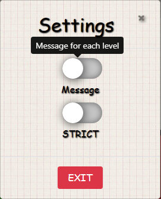
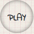

<h1 align="center">
Interactive Frontend - Milestone Project 2 - Simon Game - Stefan Sarbu
</h1>

<h1 align="center">

</h1>


<div align="center"> 

[Simon Game](https://github.com/iiostefanos/simon-game) is a memory game from 1978, fit for young and old 
to test the memory and skill. 
This game features a STRICT option to make the game more challenging yet rewarding, a Message option if the player wants to get an encouragement after each level that passes, a losing and a winning feature is also included to give the player the best experience that can expect. The original colors were kept and funny sounds will cheer up everyone. Enjoy!
<br><br>
[**View Simon Game website here!**](https://github.com/iiostefanos/simon-game)

</div>


## Contents Table

1. [**UX**](#ux)
    - [**Project Purpose**](#project-purpose)
    - [**Player Experience**](#player-experience)
    - [**User Stories**](#user-stories)
    - [**Design Ideas**](#design-ideas)
    - [**Developer and Business Purpose**](#developer-and-business-purpose)

2. [**Features**](#features)
    - [**Existing Features**](#existing-features)
    - [**Features Left to Implement**](#features-left-to-implement)

3. [**Technologies Used**](#technologies-used)

4. [**Testing**](#testing)

5. [**Deployment**](#deployment)

6. [**Credits**](#credits)
    - [**Contents**](#contents)
    - [**Media**](#media)
    - [**Help with code**](#help-with-code)
    - [**Acknowledgements**](#acknowledgements)

7. [**Disclaimer**](#disclaimer)


## UX

### Project Purpose

The Simon game is a very basic memory game but its main purpose is to provide a fun experience to users of all sort of ages.

### Player Experience

- Player's experience is simple, easy and has intuitive feel for the game from the beginning. The PLAY button is accessible, because its position is in center. It can be clicked at any time in the game. There is a PLAY button also inside the modals for Lose or win.  
- 'How To Play' button has been provided for the user to know the rules of the game and other options.

- There are funny sounds & lighten colors added to the game in order to offer the user/player a catchy feeling.
Winning & losing features aren't missing, indivdual modal pop-ups & sounds to give the user/player a better experience an information that is required.

- Back button or to reload the page aren't present. So, the player can focus more on the game without being disturbed.

### User Stories

- #### As a player, I am expecting to see:
    - A professional and attractive game that will keep me more into playing.
    - Basic, simple and yet functional controls to ensure a relaxing, but challenging experiencethat the game is not.
    - Each side has a different sound so that the player/user doesn't get confused.
    - Some information to be displayed with score, and other achievements.
    - A goal to strive for whilst playing the game.
    - Easy to understand interface and pleasant sounds which give a nice feel to their specific purpose.
    - Option(s) to choose from while playing, with increased/decreased levels of difficulty.

### Design Ideas

The design of the game is an adaptation of the original Simon Game from 1978 with a slightly modernized and simplified touch to it.

- #### Fonts

    - The font **'Indie flower'** was chosen as the primary font to create the feel for a unique style and hand-writting look to give the impression that is somehow played on a piece of paper.
    - The font **'Arhitects Daughter'** was chosen for the modals to offer a cheerful and easy reading .

- #### Colors

    - **Main Heading and Footer -** A classic black color for the font was chosen to smoothly contrast with the  background of the page.
    A transparent grey background color was chosen for the header and footer sections to allow the main background to be seen .
    
    - **Simon Board Border -**  Black color from the original Simon Game was kept as a nice separation between each color on the board.
    
    - **Colored Sides -** The sides kept their style with the 4 (four) original colors of the game 'green', 'red', 'yellow' and 'blue'.
    
    - **Control Area -** Main background kept here as well with simple black text to be visible for the player/use.
    
    - **PLAY Button(s) -** A green color has been chosen for the play buttons options inside the 'Win' and 'Lose' Modal, while the main 'PLAY' button has a cool grey-trnsparent look with black text. 
    
    - **Score Display -** The score display has been styled to look alike the 'PLAY' button in order to give simmetry to the control area. 
    
    - **STRICT Slider -** A black and grey color for the STRICT slider to indicate whether STRICT mode is active or not. Black means it is activated, grey means it is deactivated.

    - **Message Slider -** Also black and grey color for the Message slider to indicate whether Message mode is active or not. Black means it is activated, and by that the player/user will receive a message after each level that he passes, while grey means it is deactivated, so no message displayed. 

    - **Okay Button -** It can only be found inside 'Message' modal. So, the player/user will have access to this green 'Okay' button if 'Message' mode is activated. 
    
    - **How-To-Play Button -** A light grey color with transparency was chosen for the How-To-Play button together with the keypad icon to announce the user/player that there is the information that will describe how the game is played.
    
    - **Close Buttons -** A red color has been chosen for the close buttons in modals, as red would determine the player not to drop the game and choose the green color, to keep on playing .

- #### Styling

    The goal was to have a thrilling experience as possible, during the play, some effects as `box-shadow`'s
    have been included to offer a professional and innovative look for the game but in the same time to try to keep close to the original design of the game, 
    `cursor`'s have been added to each active clickable item for a better indication of where and/or when the player/user can click.
    Style was chose also not to bother and to get tiredness for the eyes. 4 (four) main colours on the sides and black, white and grey to give a feeling of tranquility. Fonts were intentionally chosen as a hand-writting type to give the player/user the impression of taking notes on a real paper.
    
    **Special styles:**
    
    - **Flashing Sides -** Sides are being highlighted to replicate a real flashing of a light, making use of
    inset and non-inset `box-shadow`'s, the effect has been accomplished.
    
    - **PLAY Button** Carefully designed and tested to act as a real button. Again, an inset
    `box-shadow` upon clicking, gives the effect of a button being pressed.
    
    - **STRICT and Message Slider -** The effect of these sliders was made with the help of a video seen you YouTube.
    [Feel free to check this link!](https://www.youtube.com/watch?v=BQSNBa3gZJU)
    
    - **Buttons -** All of them buttons are styled to slightly reduce in size when each of them is clicked. Giving them
    the effect of a real button being clicked.
    
- #### Backgrounds

  - The main background, modals, control area of the Simon Game is the same image called "Graph Paper" (2017-04-25),
  and I want it to be used several times because it gives a fresh and handy layout.

  - I have chose this background because I was thinking that a memory game like Simon would look nice if it's on a paper like this, reminding us of school when we used to do math exercises and to write down everything.
    

    
### Developer and Business Purpose

-  Every feature must run with its intended
function at any given time and should be prepared for any  fast clicking or clicking different parts of the board
when each feature is running or not running at unexpected times.

- Must show clear & professional examples of JavaScript and jQuery.

- A good example project to have as part of a portfolio.


## Features

### Existing Features
1. #### Dashboard 

    - The interface is simple and easy to use. The player/user will be able to see the header, footer, a 'How-To-Play' button, 'Settings' button and 
     the Simon  Game Board. 
    
    - The colored sides aren't active at first and if the user/player clicks them, they will not respond.
    
    - The score displays these symbols '||' (as being on pause or in waiting mode) until the first game is initialized by pressing or clicking 'PLAY'.
    
    - STRICT mode and Message mode will have a default setting of NOT being 'active'.
    

    <h1 align="center">
    
    </h1>
    <br>
2. #### Colored Sides 

    - The 4 sides with the colors of 'green', 'red', 'yellow' and 'blue' represent the main component of the game. 
    
    - When the player/user starts the game, one of the sides  will be highlighted with a different sound. When the pattern has finished being generated by the computer,
    it will then become 'active' for the player/user to click each side in the right order.
    
    - It is good to mention that the player/user cannot  click on the sides whilst the computer pattern is running, when a game is not being played, when you win or lose the game. 
    
<br>
    
    
3. #### 'How-To-Play' Button
  
    <h1 align="center"> </h1>

    -  'How-To-Play' button opens a modal where is  presented the information about how the game is played, the rules of the Simon Game.
    The clickable down-arrow icon is to enable the player/user to scroll down when it's clicked. 
    
        **Titles:**
        
        - **Objective** - A brief description of how the game is played and to inform the player/user of the rules and features.
        - **To Win** - To inform the user of how they can win the game. This has been provided in case the user is confused about how they can achieve a win.
        - **Button** - The 'PLAY' button is used to start the game.
    
    <br>
    <div align="center"> 
    
    </div><br><br>

4. #### 'Settings' Button
  
    <h1 align="center"> </h1>

    - 'Settings' button opens a modal where the player/user can activate or deactivate the STRICT and/or Message mode at any time in the game. 'EXIT' button closes the modal. 
    
    
    <br>
    <div align="center"> 
    
    
    </div><br><br>

5. #### Lose Modal

    - Player has to be in STRICT mode, so that the 'Lose' modal will appear with the score displayed.
    Inside the modal there are options to PLAY a new game or to Close the modal by clicking the 'X' in the up-right corner or the 'Close' button. 
    
    <br>
    <div align="center">  
    
    </div><br><br>
    
    
    
6. #### Win Modal

    - STRICT mode enabled and 20 correct sequences (without making any mistake), the player/user becomes the WINNER of the game. Win modal will be displayed together with a
    celebratory sound. The maximum score of '20' is shown and the 2 options: to either begin
    a new game by clicking the 'PLAY' button or to close the modal using 'X' or 'Close' button.
    - STRICT mode disabled will allow the player/user to win by scoring '20' but this time there is the option to 'Try' in case that the sequence was mistaken by the player. This way the player gets the chance to repeat the pattern until is correct.
    
    <br>
    <div align="center">  
    
    </div><br><br>
    
7. #### PLAY Button

    - When 'PLAY' is clicked, the game will start and the computer will begin its first pattern for the player to follow.
    - There's a new sequence shown every time that the 'PLAY' button is pressed. 'PLAY' button can also be found in the Lose Modal and in the Win Modal so the player/user can begin the next sequence right away.
    
    <br>
    <div align="center">  
    
    </div><br><br>
    
8. #### STRICT Slider and Message Slider

    - The 'STRICT' slider it's been included to add 2 different options of playing. When 'STRICT' mode is active/On (black), if the player gets a wrong sequence, the game is over. If 'STRICT' mode is not active/off (grey), the user/player will be able to repeat a sequence again until will get it right. STRICT mode can be enabled/disabled at any time by the player.
    
    - 'Message' slider has been implemented by me into the Simon game because I was thinking that the game might become boring after a while and with these messages after each level the player will have more fun and will get encouraged to go on and continue, knowing that will have some sort of reward and the challenge of finishing the game will be more thrilling. 'Message' mode is active/enabled (black) and 'Message' mode is not active/disabled (grey). 
    
    <br>
    <div align="center">  
    
    </div><br><br>
    
9. #### Score Display

    - At first the page is loaded, the score display will show '||', when the player clicks 'PLAY' the number '0' will appear in the score display. 
    - With each pattern followed correctly
    the score display will increase by 1. The score display will show the number of sequences done correctly by the player, not at which level the player is currently on.
    
    <br>
    <div align="center">  
    
    </div><br><br>

### Features Left to Implement

1. #### Graduated STRICT mode

    - For Beginner, STRICT mode option where the player can wil score 20 until becomes the winner. 
    - Intermediate, where the winner would have to reach level 30. 
    - Advanced, in order to become the winner, the player will have to reach level 50. This would be the hardest challenge in STRICT mode.

2. #### Player Data Storage and High Score Modal

    - A top 10 table where the players can enter their name and it will be displayed the best scores.
    
    - A High score modal can be added so that the players can try to beat the best result.
    
  
## Technologies Used

- This project uses HTML, CSS, JavaScript and various different technologies to work as helpers to the languages.
- #### [Cloud9](https://c9.io)
    - **Cloud9** is an IDE used to develop the website.
- #### [Bootstrap](https://www.bootstrapcdn.com/)
    - **Bootstrap** is used to create easier & cleaner responsiveness in addition with helping maintain padding and margins.
    - It's also used to include modal features to the website to give it a professional look.
- #### [Google Fonts](https://fonts.google.com/)
    - **Google Fonts** has been used to provide clean and eye-catching fonts to the website.
- #### [JQuery](https://jquery.com)
    - **JQuery** has been used to simplify DOM manipulation.
- #### [Font Awesome](https://www.bootstrapcdn.com/fontawesome/)
    - **Font Awesome** has been used to add icons to the website.

- #### [GitHub](https://github.com/)
    - **Github** is used: 
    1. As a remote backup of code used in the project.
    2. As a remote server for another user to see the code used in the project.
    3. For users to view the deployed version of the website. The deployed version can be viewed [here](https://github.com/iiostefanos/simon-game).


## Testing

## Manual Testing

A number of manual tests were done to ensure the website was working with it's intended purpose and use.

### Testing 

Tested numerous times in Browsers: Chrome, FireFox and Internet Explorer on a Laptop.

#### 1. Dashboard

I checked the/if:

- Arrangement on the page.
- Score to display "||".
- None of the sides were clickable .
- Background was fixed when scrolling up and down on the page.
- The header and the footer were at their place .
- When hovering over the PLAY button and STRICT switch, there was a cursor that appeared to indicate that they're both clickable.
- All spelling was correct and the text has a good position.
- 'How-To-Play' button was positioned just above the Simon Board.
- All controls and displays were sitting correctly on the page.

#### 2. 'How-To-Play', 'Message' and 'Settings Modal

I checked that:

- Position when it's opened is correct.
- Background display is shown.
- A cursor appears each time a button has been hovered over.
- Spelling, fonts and text were correct, at the right place.
- The Close/Exit/Okay buttons at the bottom slightly darkens in color when hovered over and is slightly reduced in size when clicked to indicate it's been clicked.


#### 3. 'Lose' Modal

I checked that:

- Losing sound is generated.
- Has a good position.
- Background display is present.
- The score is correctly displayed.
- Spelling, fonts and text were correct, at the right place.
- The PLAY button is slightly darkened when hovered over and that the modal closes and a new game will begin when the button is clicked.
- The close/exit button at the bottom slightly darkens in color when hovered over and is slightly reduced in size when clicked to indicate it's been clicked.

#### 4. 'Win' Modal

I checked that:

- Winning sound is generated.
- Good location on page.
- Background display is present.
- The maximum score displayed correctly.
- Spelling, fonts and text were correct, at the right place.
- The PLAY button is slightly darkened when hovered over and that the modal closes and a new game will begin when the button is clicked.
- The close/exit button at the bottom slightly darkens in color when hovered over and is slightly reduced in size when clicked to indicate it's been clicked.

#### 5. PLAY Buttons

I checked that:

- "0" is displayed when PLAY is pressed to start a new game.
- The PLAY buttons in modals work as expected.
- The first patern is being generated on the click of the button.
- If 'PLAY' button respond at any time during the game.

#### 6. STRICT and Message Slider

I checked that:

- The functionality of thes switches is appropriate and if it's working as expected .


#### 7. When the game is in play

I checked that:

- When a computer pattern is being generated, the sides are deactivated at all times.
- After being generated by the computer, the sides are then active and will allow the player to click on them.

- There are no unnecessary glitches such as lighting or sound glitches that can be produced when the sides are pressed too quickly.

#### 8. Testing on Internet Explorer

- There is the need to allow the blocked content.
- Fonts inside modals are recognized.
- Switch doesn't come up stylized.

### Testing on tablet and mobile devices

The website was tested on , Samsung Galaxy S5, Pixel 2, Pixel 2 XL, iPhone 5/6/8/8 Plus/X, iPad, and iPad Pro through Chrome and Mozilla. It's also been run through Chrome Developer tools in the 'Responsive' setting changing the width and height and changed to each device setting.


 #### Error with sounds.

Sometimes it can be observed some kind of a lag with difference between showing side and the sound comes up a little late or at all 
    
    
 #### NOT tested in Safari or on a Mac.

    
## Further Testing

- Tested in Chrome DevTools on all different devices and by scrolling up and down in the responsive setting.


## Deployment

The project was built using [Cloud9](https://c9.io), through a built-in function called 'Git', I could commit
the project & push it up to [GitHub](https://github.com/).

- To view the deployed version of [Simon Game](https://github.com/iiostefanos/simon-game), I needed to take the following steps:
    - Log in to [GitHub](https://github.com/).
    - Select **iiostefanos/simon-game** from the list of repositories.
    - Select **Settings** from the navbar near the top of the page.
    - Scroll down to where it says **Github Pages**, there is a subtitle labelled **Source**, click that and change the source to be **master branch**.
    - The page is automatically refreshed and ready for deployment, it can take up to 5-10 minutes for it to be viewable.

- To add this repository to your local workspace:
    - Click on the [Simon Game repository on GitHub!](https://github.com/iiostefanos/simon-game) link.
    - Select the green button on the right-hand side named **Clone or download** and copy the clone URL.
    - Go into your local workspace and open up a new terminal (git bash).
    - You will need to be inside of the directory that you want to add the cloning to.
    - Type `git clone ` and paste the URL you copied from GitHub and press enter. It should look like this: 
```console
git clone https://github.com/*username*/*repository*
```
The process of cloning will now be completed. For further information on cloning,
 visit [How to clone from GitHub](https://help.github.com/en/articles/cloning-a-repository).


## Credits

### Contents

- All Content has been thought of and written by the Developer. 

### Media

- #### Images
    - Background image, modal, control area was downloaded from www.subtlepatterns.com and it's made by Tomislava Babić with the title "It’s hip to be square".

- #### Sounds
    
     The 4 (four) sides sounds, together with a losing sound and a winning sound were downloaded from here:
    
    - https://www.youtube.com/audiolibrary/soundeffects?nv=1
 
    - https://www.myinstants.com
    
    - http://www.freesfx.co.uk

    - SoundBible.com

### Help with code

- Got inspired and helped to write my HTML: [How to Program a Simon Game: HTML](https://www.youtube.com/watch?v=zwKoo7VDj44).
- Got inspired and helped to write my CSS: [How to Program Simon Game: CSS](https://www.youtube.com/watch?v=muPIIfjazcU).
- Got inspired and helped to get started with the Javascript for the Simon game: [Simon Game JavaScript Tutorial for Beginners](https://www.youtube.com/watch?v=n_ec3eowFLQ).
- Got inspired and helped to get the effect for the STRICT and Message sliders: [Css Custom Animated Checkbox](https://www.youtube.com/watch?v=BQSNBa3gZJU).
- Got inspired and helped to get the modal to scroll down when you click the 'arrow-down' icon in 'How-To-Play' modal: [Smooth Scroll Tutorial Using jQuery](https://www.youtube.com/watch?v=6Bd37vCHQ_U).
- Got inspired and helped to get each of the colored pads to light up like a real light: [Creating Glow Effects with CSS](https://codersblock.com/blog/creating-glow-effects-with-css/).
    
The code learned from the videos were not copied into the project, they were used as help and guidance to be interpreted in a different and unique way.

### Acknowledgements

A huge thank you to:

- Emanuel Virca - For providing help and teaching support wherever necessary and also there as a guide if I'm ever stuck with anything.

- Rahul Lakhanpal (Rahul_mentor) - For discussing ideas, UI and UX strategies taking the time to review the project and offering me constructive criticism to help make improvements.

- Haley Schafer (haley_ci) for helping and offering suggestions in simplifying the workflow.

- Charlie Jeffries-Tipton (CharlieJT) for giving feedback and suggestions on how to fix problems that occurred.

## Disclaimer

All content on the website, including images, are used for educational purposes only.